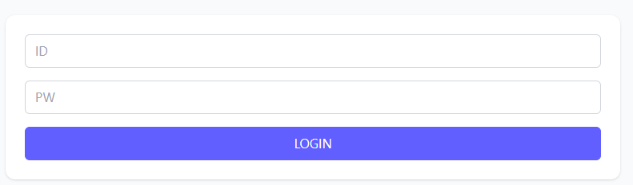
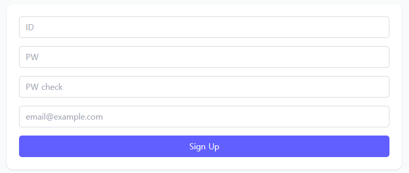
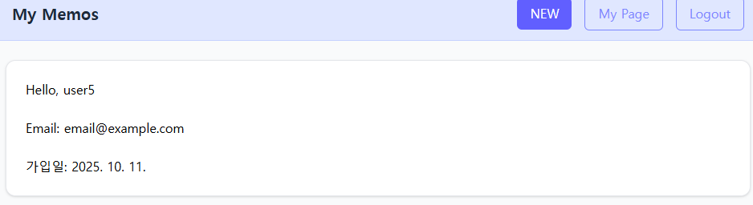
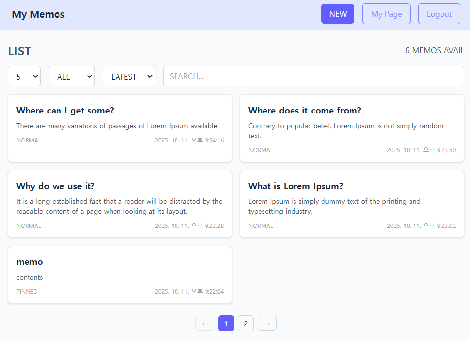
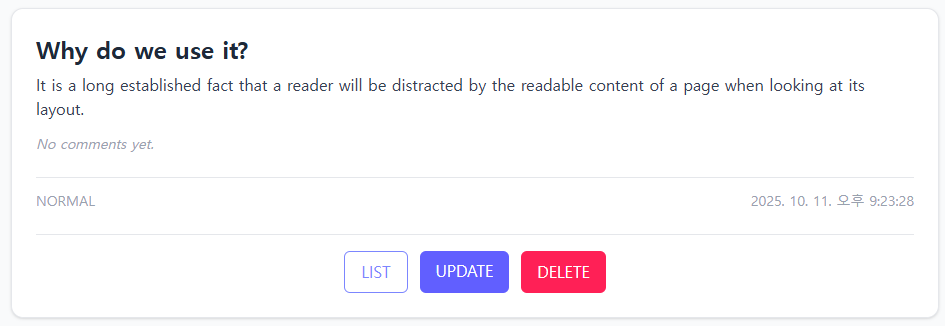
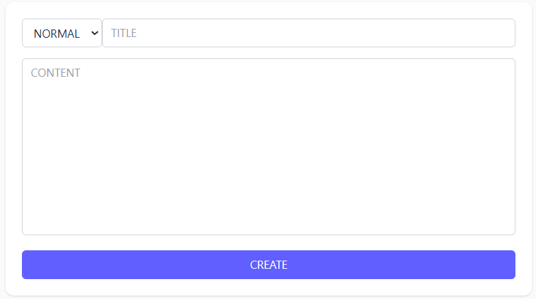
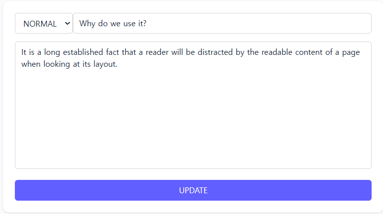
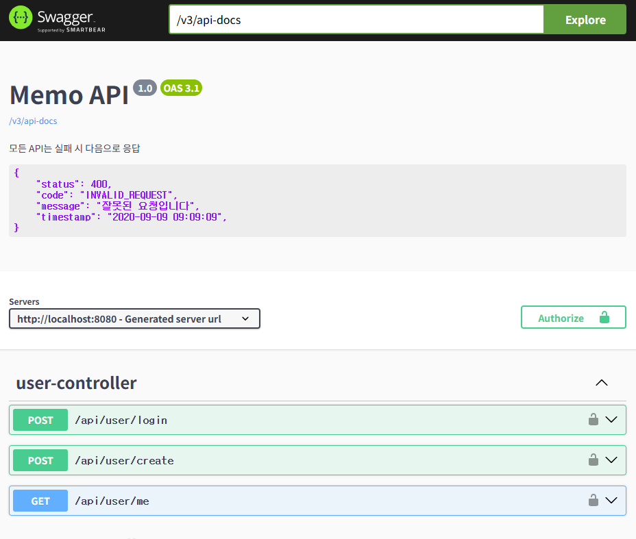

# Memo Project


## 개요
간단한 메모 관리 앱
- 백엔드는 Spring Boot 3 + JPA
- 프론트는 React + Axios 기반입니다

## 주요 기능
- JWT 로그인/회원가입
  - 
  - 
  - 
- 메모 CRUD(중요, 완료 상태 등)
  - 
  - 
  - 
  - 
- Docker Compose로 백엔드와 DB, 프론트엔드 연동
- Swagger API 문서 자동화
  - 
- 시간대 동기화 문제 해결(OffsetDateTime) 

## 기술 스택
- Spring Boot 3
- MySQL(Docker)
- Axios/Context API
- Swagger(Springdoc)
- Docker Compose

## Postman API Test
- [random-memo.postman_collection.json](./docs/random-memo.postman_collection.json)
- [random-memo-env.json](./docs/random-memo-env.json)
- Import to Postman → Run “users/login” → Test all memo APIs

## API Documentation (Swagger)

이 프로젝트는 **SpringDoc OpenAPI 3** 기반의 Swagger UI를 제공합니다.  
서버 실행 후 아래 주소에서 API 명세를 확인할 수 있습니다 

- **Swagger UI:** [http://localhost:8080/swagger-ui/index.html](http://localhost:8080/swagger-ui/index.html)
- **OpenAPI JSON:** [http://localhost:8080/v3/api-docs](http://localhost:8080/v3/api-docs)

> 로그인 후 발급된 `Bearer Token`을 Authorize 버튼에 입력하면,  
> 인증이 필요한 모든 API를 Swagger UI에서 직접 테스트할 수 있습니다.

## 🐳 Docker Compose

이 프로젝트는 Docker Compose를 이용해 백엔드(Spring Boot)와 데이터베이스(MySQL), 프론트엔드(React)를 컨테이너 환경에서 실행합니다.

### 📦 실행 방법

```bash
# 빌드 및 실행
docker compose up -d --build

# 중지
docker compose down
```

### 서비스 구성
- app	8080	Spring Boot 백엔드 (Memo API)
- db	3308 → 3306	MySQL 9.4 데이터베이스
- frontend 5173 프론트엔드 

### 환경 변수 (.env)
.env 파일을 생성해 다음과 같이 환경변수를 지정할 수 있습니다.
.env 파일은 Docker Compose가 자동으로 읽습니다.
운영 환경에서는 보안을 위해 .gitignore에 추가하세요.

```ini
MYSQL_ROOT_PASSWORD=root
MYSQL_DATABASE=memos
```

### Docker Compose
./gradlew bootJar 빌드 없이도 Dockerfile에서 자동 빌드하여 실행됩니다.

## 이후 계획
- UI 개선(컴포넌트화, 스타일링): 완료
- JWT 재발급
- README 추가
